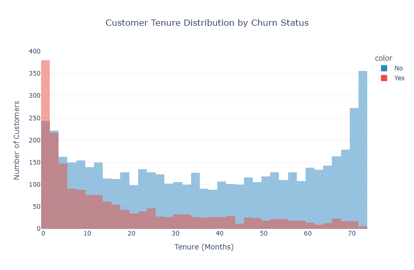
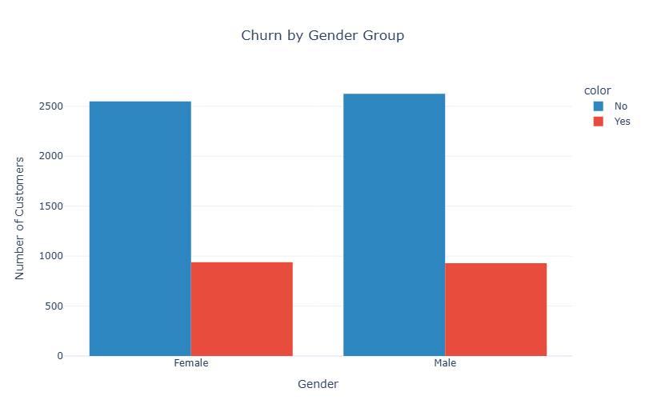
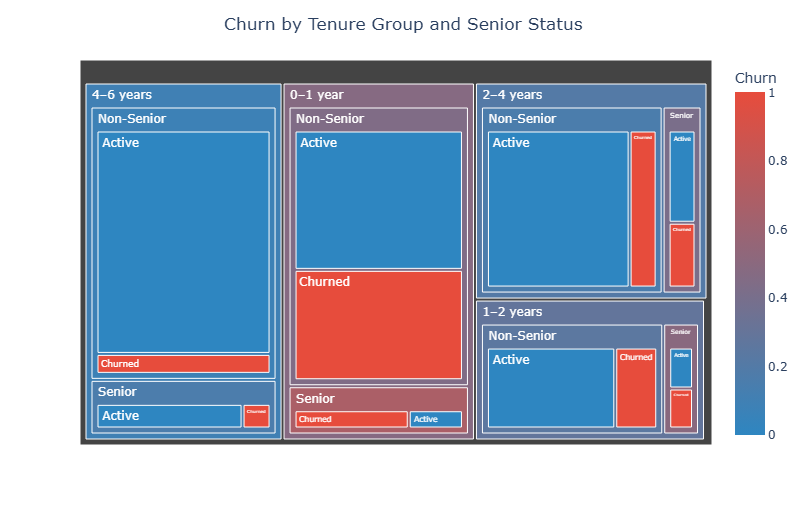
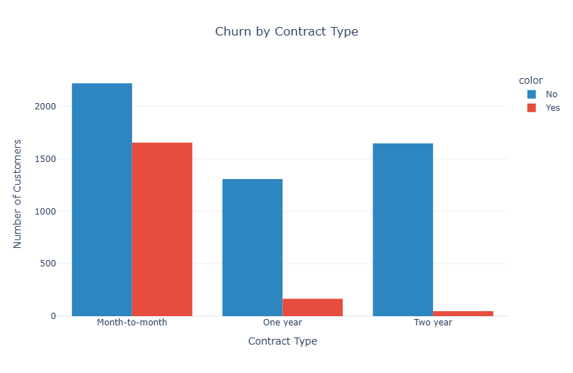
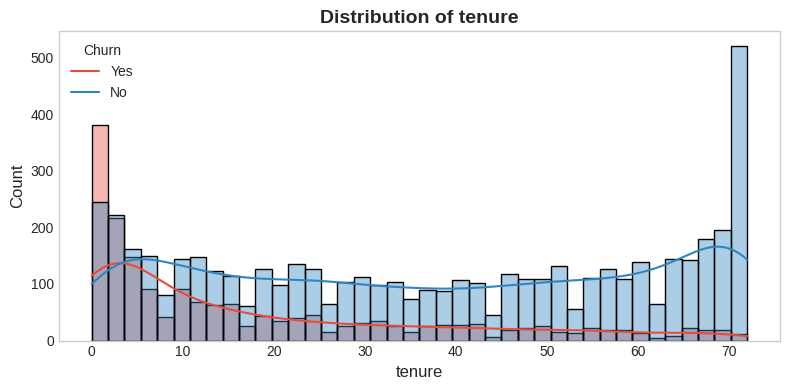
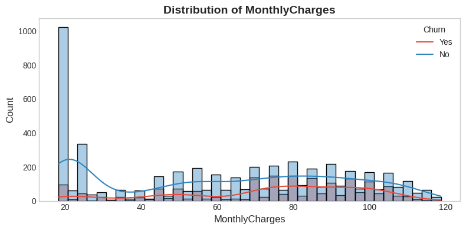
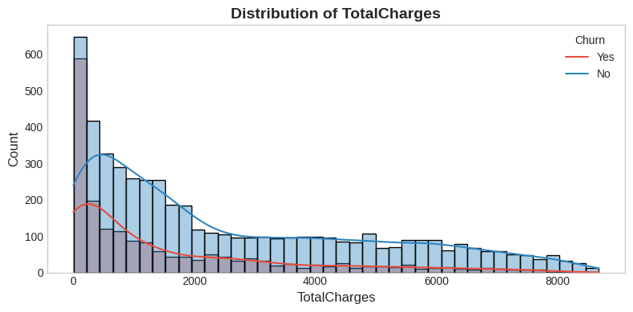
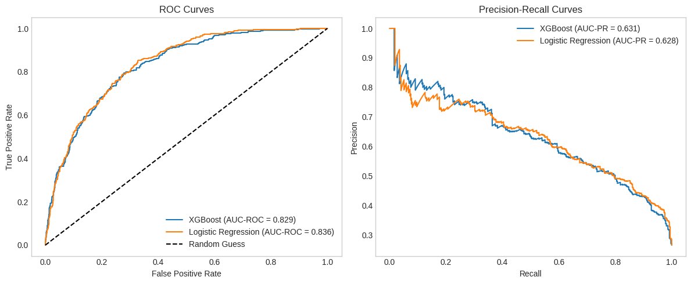
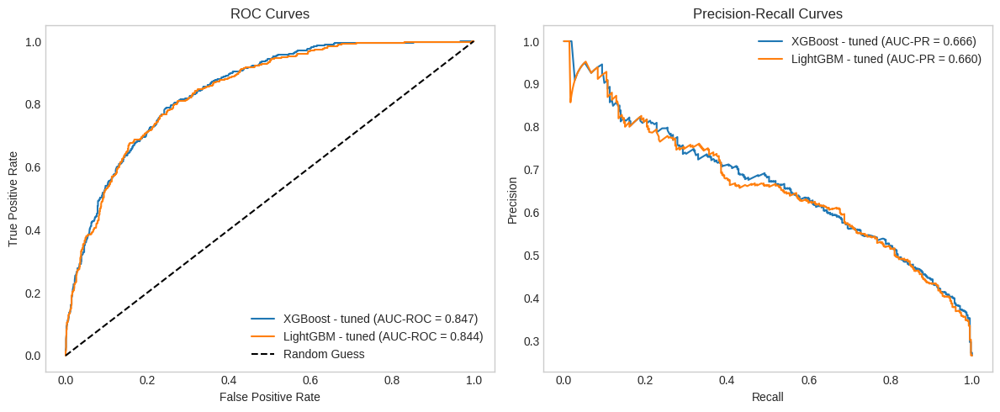

 

# Customer Churn Prediction Project

## Project Overview

### **Objective**

Analyze Telco customer data to understand the factors driving customer churn and build a predictive model to identify at-risk customers. Provide actionable insights for retention strategies based on data patterns and model outcomes. 

### **Domain**
Telecommunications

### **Dataset Source**

[Kaggle – Global Superstore Sales Data](https://www.kaggle.com/datasets/rohitsahoo/sales-forecasting/data)

### **Dataset Size**
Records - 7,043 | Features - 21

---

## Data Understanding
- Dataset: 7043 customer records, 27 features.
- Features include demographic info, contract type, internet service, payment method, tenure, charges, and derived features like `AvgChargePerMonth` and `TenureGroup`.

---

## Data Preparation
- Encoding of categorical features completed.
- Features for regression: `tenure`, `MonthlyCharges`, categorical features (excluding `TotalCharges` & `AvgChargePerMonth`).
- Features for tree-based models: `tenure`, `MonthlyCharges`, `TotalCharges`, categorical features; `AvgChargePerMonth` optional.
- Missing values and outliers handled.

---

## Exploratory Data Analysis (EDA)
- Visual analysis of churn across tenure, gender, contract types, internet service, payment methods, and monthly charges.
- Segmentation analysis identified vulnerable groups: short-tenure, senior citizens, month-to-month contracts, and electronic check payers.

---

## Statistical & Diagnostic Analysis
statistical validation and diagnostic checks to ensure data quality and model readiness

---

## Predictive Modeling
- Models evaluated: Logistic Regression, KNN, Random Forest, XGBoost, LightGBM.
- Primary evaluation metric: PR-AUC (suitable for imbalanced datasets)

---

## Hyperparameter Tuning & Model Optimization
- Two-phase approach:
  1. **RandomizedSearchCV**: Broad search to identify promising parameter regions.
  2. **GridSearchCV**: Fine-tune around best regions for optimal performance.
- Focused on PR-AUC and minimizing false negatives (catching churners).
- Tuned models achieved:
  - LightGBM (tuned): PR-AUC 0.666, Recall 0.810
  - XGBoost (tuned): PR-AUC 0.666, Recall 0.532
  - Random Forest (tuned): PR-AUC 0.656, Recall 0.775

---

## Final Model Evaluation
- **Best Model (business-aligned): Tuned LightGBM**
- Confusion matrix analysis indicates high recall (minimized false negatives), suitable for retention campaigns.
- Feature Importance (Tree-based and SHAP) highlights:
  - `Contract_Two year`, `tenure`, `InternetService_Fiber optic`, `MonthlyCharges`, `Contract_One year`, `PaymentMethod_Electronic check` as key drivers.
- Threshold analysis shows optimal cutoff at 0.45, balancing precision and recall.

---

## Recommendations

### Business Recommendations
1. Focus retention efforts on:
   - Month-to-month contract customers
   - Fiber optic users
   - Customers paying via electronic check
2. Encourage longer-term contracts and automatic payment methods to reduce churn.
3. Tailor offers and communications for short-tenure and senior-citizen segments.

### Modeling Recommendations
1. Use PR-AUC and recall as primary evaluation metrics for future churn prediction models.
2. Consider feature engineering on service bundles, customer engagement metrics, and interaction history.
3. **Advanced Hyperparameter Tuning (Future Work)**:
   - Bayesian optimization (Optuna/Hyperopt) for efficient parameter search
   - Multi-objective optimization balancing PR-AUC vs cost-sensitive metrics
   - Ensemble-level tuning (stacked or hybrid models)
   - Hyperband / Successive Halving for larger search spaces
---

## Conclusion

This project demonstrates a complete churn prediction workflow on the Telco dataset, from data understanding and preprocessing to model building, tuning, and evaluation. Tree-based models, particularly tuned LightGBM, show the best balance between recall and PR-AUC, aligning with real-world business priorities of minimizing missed churners. Feature importance and SHAP analysis highlight key drivers like contract type, tenure, and internet service, providing actionable insights for business strategy. Future improvements, including advanced hyperparameter tuning and ensemble approaches, can further enhance predictive performance and robustness.
